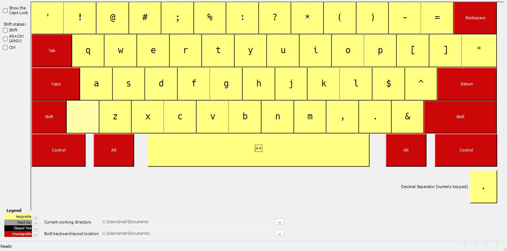
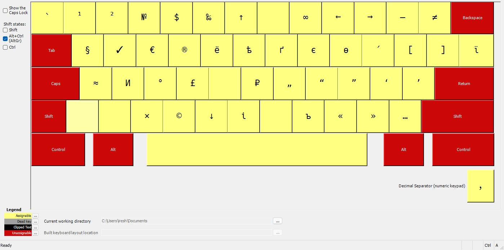

# Universal-Layout

Universal Keyboard layouts US, RU for Windows

## English

## Russian

### Alternative

- [Original impresion, version by Nikita Prokopov](https://github.com/tonsky/Universal-Layout) (MacOS)
- [version by Nikita Shirokov](https://github.com/braindefender/universal-layout) (Windows, Linux & MacOS)
- [version by Michael Brinchuk](https://github.com/Thecentury/Windows-Universal-Layout) (Windows)
- [version by Constantine Molchanov](https://github.com/moigagoo/universal-layout-linux) (Linux)
  
